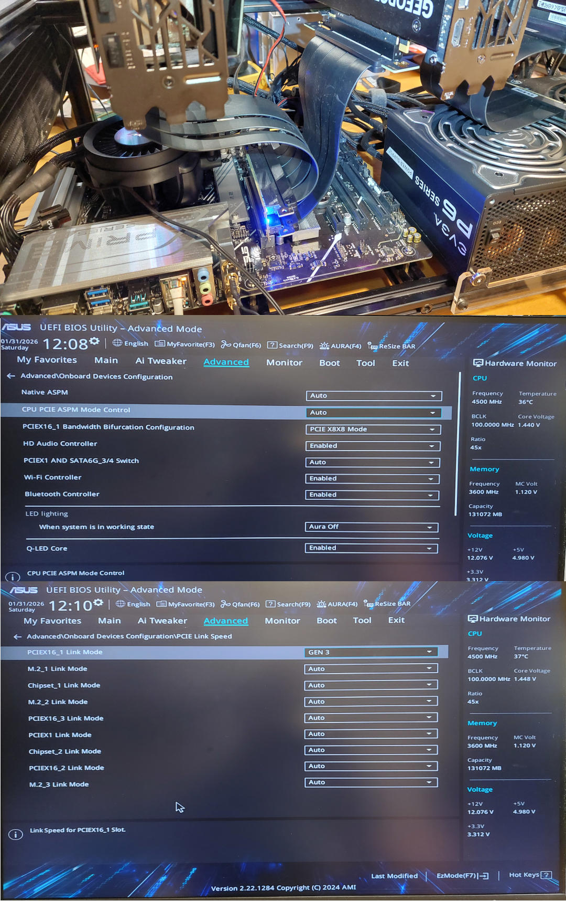

# asus_X670-P_WIFI_Bifurcation_problems
PCIEX16_1 port has x8/x8 bifurcation available

If we don't set the PCIEX16_1 port speed to GEN 3 (but GEN4) then we get LaneErr errors on the other x8 port, but the card does show up, but is extremely slow.

If we set PCIEX16_1 port speed to GEN 3 then there is no errors shown in any of the PCIe lanes, but the other card is still extremely slow, maybe working only with one single lane?

If we connect 3 card all to separate PCIe buses (having x16 + x4 +x4) then the x4 cards are also very fast still.

CPU does have integrated GPU which we use for displays and not any of the Nvidia cards...

See the ```lspci -vv``` diff of the cards [https://gist.github.com/...](https://gist.github.com/jarkko-hautakorpi/0295ffb5dceffc3b77a1ea898ee15cb4/revisions?diff=unified&w)


